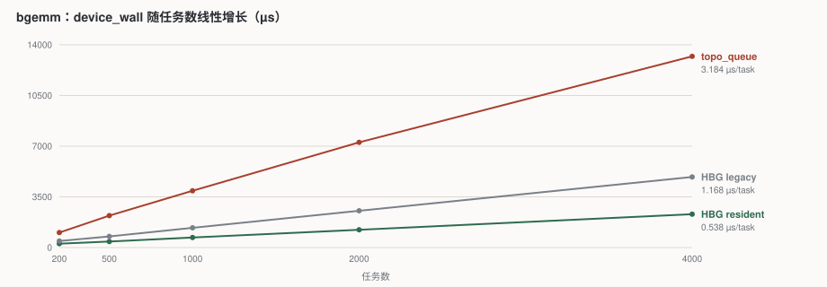
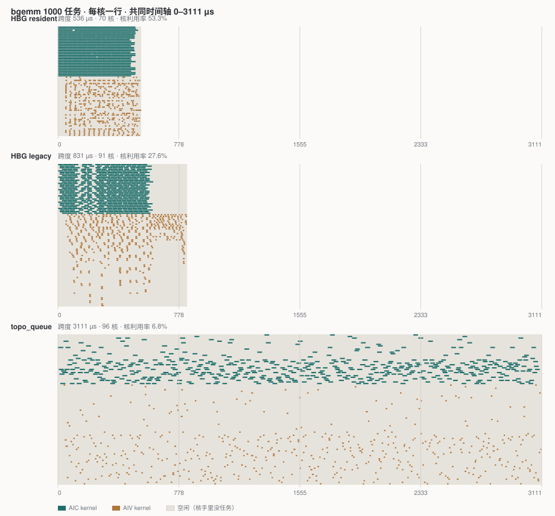
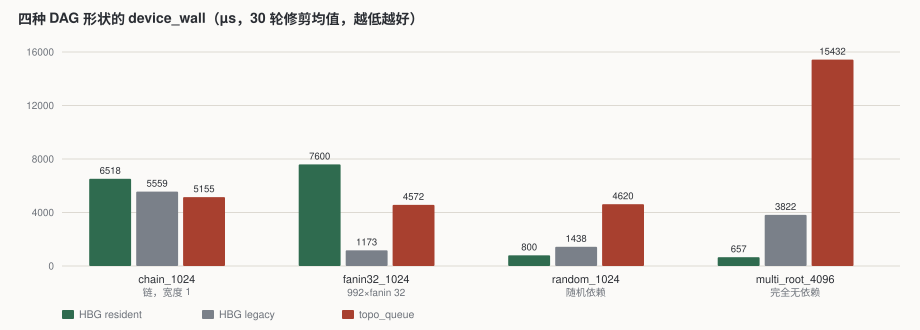

# A5 三种调度器实测：resident / legacy / topo_queue

**日期**：2026-09-30 · **硬件**：A5 单卡（实测 96 个 AICore：32 AIC + 64 AIV）

一句话结论：**topo_queue 的单队头每发出一个任务要固定花约 3.8 µs，这个成本是否致命完全取决于负载形状**——4096 个无依赖任务上它比 HBG resident 慢 23 倍，bgemm 上慢 5.9 倍，而在 1024 长的串行链上它是三者中**最快**的。

---

## 1. 被测的三种方案

三者共用同一份 host 建图代码（topo_queue 的 `build_config.py` 直接指向 `../host_build_graph`），差别只在设备侧怎么把任务交到核手上。

| 方案 | 调度器在哪 | 任务怎么到核上 | 解依赖方式 |
| --- | --- | --- | --- |
| **HBG resident** | AICore，每个 cluster 一个 AIV 当调度器 | 调度器推送 | wake list：任务挂在最晚提交的未完成前驱上 |
| **HBG legacy** | AICPU 线程 | 调度器推送 | 同上 |
| **topo_queue** | 无中心调度器 | **核自己 CAS 抢队头** | 核认领后原地自旋等前驱 counter |

resident 和 legacy 的四份代码（`aicpu_executor.cpp` / `aicpu_legacy_executor.cpp` / `aicore_executor.cpp` / `aicore_legacy_executor.cpp`）都编进同一份二进制，运行时靠 host 写下的 mode 字选择。topo_queue 是加的第三对。

测 legacy 时用一处临时改动强制回退（`create_scheduler_state` 里 `TaskKind::GRAPH || true`），测完立即恢复。

---

## 2. 测量方法

| 项 | 做法 |
| --- | --- |
| 指标 | `device_wall`——设备自己的系统计数器测的，**不含 host 建图** |
| 取值 | 修剪均值，去掉最高最低各 10% |
| 干净数字 | `--rounds 100`（或 30）`--skip-golden`，**不开任何诊断** |
| 泳道数据 | `--rounds 1 --enable-chip-swimlane 2`，单独一次运行 |
| 依赖图 | `--rounds 1 --enable-dep-gen`，再单独一次 |
| 公平性 | 同一张卡、独占锁、同一时段；kernel 源码**逐字节相同**；唯一变量是 `@scene_test(runtime=)` |

`--rounds > 1` 时所有诊断会被自动关闭，所以泳道必须单轮跑。**泳道那次的绝对时间不能当性能数字用**——采集本身有观测者效应，legacy 走的 AICPU collector 路径每次约 0.8 µs。性能一律以不开诊断的那批为准。

### 两批负载的覆盖度不同

这一点影响结论的可信度，先讲清楚：

| 测了什么 | bgemm | 四种 DAG 形状 |
| --- | :---: | :---: |
| `device_wall`（3 方案） | ✅ 5 个任务数 × 30 轮，另加 100 轮 | ✅ 30 轮 |
| 泳道 + `sched_overhead_analysis`（3 方案） | ✅ | ✅ 24 次单轮采集 |
| 阶段拆解（`--tree`） | ✅ | ❌ |
| 认领间隔、队头争抢的直接证据 | ✅ | ❌ |

**第 5 节的队头机制分析全部来自 bgemm**，四种形状没有重复做这一层——但第 4 节的两个关键结论都拿到了 trace 佐证（4.1 的关键路径归因、4.3 的长尾分布）。

还有一处**未完成**：4.3 节需要知道 resident 的长尾里到底落了多少个任务，这个数字能区分"一次性集中重分类"和"普遍变慢"。采集数据都在服务器上，但服务器从 2026-09-30 晚间断电，要假期后才能取。

---

## 3. 负载一：bgemm

### 3.1 图的结构

`examples/a5/{host_build_graph,topo_queue}/benchmark_bgemm`，参数 `num_groups=250, grid_k=2, tile=128×128`：

```text
每个 group 提交 4 个任务：
    GEMM_0 ──→ ADD_0 ──→ ADD_1          ADD_0/ADD_1 都读写同一个 C_view
                          ↑              所以 ADD_1 依赖 ADD_0（写-写串行）
    GEMM_1 ───────────────┘

总任务数   1000（500 GEMM + 500 ADD，各一半）
独立分组   250 个，组间完全无依赖
依赖边     750 条
关键路径   深度 3
```

**极宽、极浅**：500 个 GEMM 的 fanin 全是 0，开局就有 500 个任务同时就绪。提交顺序是 `GEMM, ADD, GEMM, ADD…`，队列**严格按 AIC/AIV 交替**。

### 3.2 随任务数的扩展性

`device_wall`（µs，每点 30 轮）：

| 任务数 | resident | legacy | topo_queue | legacy/res | topo/res |
| ---: | ---: | ---: | ---: | ---: | ---: |
| 200 | 266.0 | 450.3 | 1034.2 | 1.69× | 3.89× |
| 500 | 415.8 | 768.6 | 2207.1 | 1.85× | 5.31× |
| 1000 | 694.9 | 1365.5 | 3920.2 | 1.97× | 5.64× |
| 2000 | 1224.8 | 2540.7 | 7265.6 | 2.07× | 5.93× |
| 4000 | 2305.5 | 4873.9 | 13206.5 | 2.11× | 5.73× |



**三者都严格线性**，没有一个因为核多而摊薄。线性拟合出的每任务串行成本：

```text
resident     0.538 µs/task  +  153.5 µs 固定
legacy       1.168 µs/task  +  200.8 µs 固定
topo_queue   3.184 µs/task  +  623.3 µs 固定      比值 1 : 2.2 : 5.9
```

固定项是拟合外推的截距，不是实测——最小实测点是 200 个任务。两个 HBG 的残差 ≤3.5%，截距可信；topo_queue 在 200 任务点残差 −21.8%，说明它不是一条严格的直线，那个 623.3 µs 不该当物理量解释。

### 3.3 核利用率

1000 任务的单轮采集。三者的 kernel 总量几乎相同（约 20 ms），说明算的是同样的活，差别全在喂饱核的效率：

| | 跨度 | 参与核数 | Σ kernel | 核利用率 |
| --- | ---: | ---: | ---: | ---: |
| resident | 535.7 µs | 70 | 19 989 µs | **53.3%** |
| legacy | 831.0 µs | 91 | 20 883 µs | 27.6% |
| topo_queue | 3110.9 µs | 96 | 20 223 µs | **6.8%** |

topo_queue 用满了 96 个核，却只有 6.8% 的时间在算。



三张泳道共用一条时间轴，所以长度可以直接比。每行一个核，实色是 kernel 在跑，浅色是核手里没任务。topo_queue 那张的空白**几乎铺满整张图，而且均匀分布**——核不是卡在某一处，是**始终领不到任务**。resident 那张里 AIC 的 32 行排得很密，AIV 行大片空白，那是图本身的形状决定的（AIC 在关键路径上），不是调度器的问题。

采集这三张图的运行开了诊断，所以它们的绝对时长和 3.2 节那批干净数字略有出入，形状可比、数值以 3.2 节为准。

### 3.4 端到端的阶段拆解

一次完整运行（1000 任务，30 轮中位数，µs）：

| 阶段 | resident | legacy | topo_queue | 说明 |
| --- | ---: | ---: | ---: | --- |
| bind（host 建图） | 10 540.5 | 9 931.4 | 9 875.9 | 共用代码 |
| publish_image | 1 232.0 | 559.2 | 1 166.2 | 上传调度器状态 |
| prepare_execution | 460.5 | 421.3 | 419.2 | 共用 |
| **device_wall** | **694.6** | **1 362.9** | **3 922.2** | **唯一的差异来源** |
| runner_run 其余 | 1 520.8 | 1 367.2 | 1 340.3 | 启动与同步 |
| validate（回读） | 1 891.8 | 1 962.4 | 1 803.5 | 共用 |
| **run 总计** | **16 520.8** | **15 692.6** | **18 663.0** | |

**设备上慢 5.6 倍，端到端只慢 13%**——因为这个测试每轮都重新建图，host 建图占了六成，把差距稀释了。**如果图建一次反复执行**（推理解码就是这样），建图被摊薄，5.6 倍会原样变成端到端的差距。

另有一笔冤枉钱：topo_queue 的 `publish_image` 比 legacy 多约 **600 µs**。它并不使用常驻调度器，但为了从 bootstrap context 里取一个图地址，必须跑在 resident 模式下，于是 host 每轮都上传一整份它从不读取的 `SchedulerState`。

---

## 4. 负载二：四种 DAG 形状

bgemm 只是一种形状，拿它下普适结论是错的。`tests/st/a5/{host_build_graph,topo_queue}/multi_core_dag` 提供四种形状，kernel 是 `check_stress.cpp`——只校验状态、几乎不计算，所以测到的接近纯调度成本。

每点 30 轮，`device_wall` 修剪均值（µs）：

| 形状 | resident | legacy | topo_queue | 最快 |
| --- | ---: | ---: | ---: | --- |
| `mixed_chain_1024`（一条链，宽度 1） | 6518.1 | 5559.1 | **5155.1** | **topo_queue** |
| `mixed_fanin32_1024`（992 任务 × fanin 32） | 7599.7 | **1172.9** | 4571.7 | **legacy** |
| `mixed_random_1024`（随机依赖） | **800.2** | 1437.6 | 4619.7 | resident |
| `mixed_multi_root_4096`（**完全无依赖**） | **657.2** | 3821.6 | 15431.5 | resident |



分布（min / p50 / max，30 轮）：

```text
chain_1024      resident  6492.6 / 6518.0 /  6611.4     topo  4852.8 /  5158.5 /  5866.3
fanin32_1024    resident  6130.5 / 7286.0 / 10167.2   legacy   861.5 /  1148.7 /  1588.7
multi_root_4096 resident   648.0 /  657.4 /   737.9     topo 15251.6 / 15429.1 / 15903.4
```

### 4.1 串行链上 topo_queue 最快

1024 个任务串成一条链，宽度 1，**没有任何并行度**。这时瓶颈是"前驱完成 → 后继开始"的延迟，不是派发吞吐。

topo_queue 比 resident 快 21%。关键路径归因（`sched_overhead_analysis` Part 6，路径长 1023 跳）给出了直接证据：

| | 路径总长 | 其中计算 | 调度器注入 | **每跳调度成本** |
| --- | ---: | ---: | ---: | ---: |
| resident | 6853.4 µs | 913.7 µs (13.3%) | 5939.2 µs (86.7%) | 5.80 µs |
| legacy | 6016.9 µs | 1174.1 µs (19.5%) | 4842.2 µs (80.5%) | 4.73 µs |
| **topo_queue** | **4485.2 µs** | 1390.2 µs (31.0%) | 3095.0 µs (69.0%) | **3.03 µs** |

每一跳（前驱完成 → 后继开跑）topo_queue 只要 3.03 µs，resident 要 5.80 µs。**推测得到了证实**：pull 模型的核已经握着任务在原地自旋等 counter，前驱一发布 DONE 就是一次 GM 往返的事；push 模型要经过"调度器发现完成 → 重分类 → 入队 → 派发 → 核接收"好几跳。

值得注意的是，**3.03 µs 和第 5.1 节在 bgemm 上测出的 3.07 µs 认领间隔几乎相同**——它们是同一个物理量：一个核观察到 GM 上某个竞争缓存行发生变化所需的时间。这个常数在 topo_queue 里既是它的吞吐天花板，也是它的延迟优势来源。

**这是 CLC 思路真正的优势，用 bgemm 完全测不出来。**

### 4.2 无依赖任务孤立出了天花板

4096 个任务，零依赖，没有任何东西可等，所以整个运行就是纯派发：

```text
resident    657.2 µs / 4096 = 0.160 µs/task
legacy     3821.6 µs / 4096 = 0.933 µs/task
topo_queue 15431.5 µs / 4096 = 3.767 µs/task     ← 23× 慢于 resident
```

**3.767 µs/task 和第 5 节测出的 3.07 µs 认领间隔几乎完全吻合**（差值是握手和收尾）。单队头的天花板在这个用例里被完全孤立出来了。

### 4.3 意外发现：resident 在宽 fanin 下有性能问题

992 个任务各依赖同样的 32 个根。**resident 反而是三者里最慢的**，比 AICPU 调度的 legacy 慢 6.5 倍，而且抖动明显（6130–10167 µs，legacy 是 861–1589）。

trace 显示这是一个**极端长尾**，不是普遍变慢：

| fanin32 | Head OH（派发→开跑） | Tail OH（跑完→调度器发现） |
| --- | --- | --- |
| resident | P95 **0.45** / P99 **35.38** / Max **3183.04** µs，mean 4.01 | P50 10.46 / Max **3183.87** µs，mean 24.20 |
| legacy | P95 3.62 / P99 4.47 / Max **5.93** µs，mean 2.24 | P50 9.76 / Max 78.30 µs，mean 12.88 |

**绝大多数任务只等 0.45 µs，但有少数等到 3183 µs**——一个任务的等待就占了 7446 µs makespan 的近一半。legacy 完全没有这个现象（最大 5.93 µs）。

怀疑和 wake list 机制有关：每个任务挂在"最晚提交的未完成前驱"上，于是 992 个消费者全挤在同一个根的 wake list 上，那个根完成时要一次性重新分类 992 个等待者。若单个调度器串行走完这 992 项、每项约 3.2 µs，正好是 3.2 ms 量级——和观测到的 Max 吻合。

**但这还不算定性。** 需要的下一个数字是"长尾里落了多少个任务"：如果只有个位数，那是一次性的集中重分类；如果是几百个，那是普遍排队。采集数据在服务器上，断电后未能取到。

**这是 HBG resident 自己的问题，不是 topo_queue 的**，而且 resident 是已上线的 runtime。

---

### 4.4 调度开销百分比（三方 × 四形状）

`sched_overhead_analysis` 的定义：某一时刻**有空闲核**且**有已就绪但未派发的任务**，就算调度开销，按 makespan 的百分比计。

| 形状 | resident (AIC/AIV) | legacy | topo_queue |
| --- | --- | --- | --- |
| `chain_1024` | 41.3% / 40.8% | 28.1% / 23.7% | **0.0% / 0.0%** |
| `fanin32_1024` | 57.2% / 54.9% | 98.7% / 79.7% | 96.6% / 96.7% |
| `random_1024` | 98.3% / 99.6% | 98.3% / 99.4% | 99.6% / 99.9% |
| `multi_root_4096` | 0.0% / 0.0% | 0.0% / 0.0% | 0.0% / 0.0% |

读这张表要小心两处，否则会得出相反的结论：

- **`multi_root_4096` 三者全 0，不代表三者都完美。** 这个指标对**完全没有前驱的任务**按定义看不到派发延迟——文档写明"前驱全部不在 perf 集合内的任务，其 ready 回退成它自己的 dispatch"，于是 `[ready, dispatch]` 区间恒为空。而这个用例 4096 个任务全都没有前驱。实际差距见 4.2 节：0.160 / 0.933 / **3.767** µs/task。
- **`chain_1024` 上 topo_queue 的 0% 是真的低。** 和 bgemm 上那个"指标不适用"的 0%（见 5.4 节）不同：链上任何时刻最多只有一个任务就绪，而 topo_queue 的核早就认领好在等了，所以确实不存在"就绪却没人派发"的窗口。resident 的 41.3% 则是实打实的派发延迟——链上调度器的反应时间**就是**关键路径。

`fanin32` 和 `random` 上三者都接近饱和（大量任务同时就绪、派发跟不上），这时该看的是 makespan 本身而不是百分比。

## 5. 机制：队头为什么是瓶颈

### 5.1 认领严格串行

bgemm 的 500 个 GEMM 全无依赖，开局就该全部可跑。但 topo_queue 的 AIC 核一开始大量闲着。认领记录给出了原因：

```text
认领顺序        严格等于 task id 顺序，1000 个无一例外
认领间隔        mean 3.07 µs   p10 1.63   p50 2.93   p90 4.82
分时段（六段）  3.050 / 3.109 / 3.117 / 3.088 / 3.112 / 2.973   ← 全程恒定
平均在执行的核  6.6 个（共 96）
```

任务按 `GEMM, ADD, GEMM, ADD…` 交错提交，所以 500 个无依赖的 GEMM 坐在 `0, 2, 4, 6…` 这些位置上。**一个 AIC 核想拿到 index 2，必须先有 AIV 核把 index 1 的 ADD 认领走**——队头只能一格一格推进。「绝不跳过」是死锁自由证明的前提：被消费的下标如果没人执行，它的每个消费者都会永远等下去。

于是 t=100 µs 时全场只发出去约 33 个任务，而 resident 在 535 µs 内跑完了全部 1000 个。

### 5.2 是对一条 cache line 的争抢

队头停留时间**随同型空闲核数变化**，这是识别机制的关键：

| 下一个要认领的 | 队头停留 | 该类型空闲核 |
| --- | ---: | ---: |
| AIC 任务 | 3.564 µs | 27 / 32 |
| AIV 任务 | 2.580 µs | 62.5 / 64 |

纯粹的 GM 往返延迟不会有这个依赖关系。两点拟合出：

```text
停留 ≈ 1.8 µs + 47 µs / 轮询核数
```

一个只有两次读的循环要 **47 µs** 才转回来，说明这两条线已经被 96 个核挤爆——每个核每一圈都要作废并重读同一个队头和同一个 run-control 字。

**核不是被通知的，是自己轮询发现的。** 所以 AIC 核不是不肯拿，是平均要 3.6 µs 才发现该自己拿了。

### 5.3 两次减少轮询的尝试都失败了，而且方向相反

| 改动 | device_wall | 相对基线 | 原因 |
| --- | ---: | ---: | --- |
| 基线 | 3990 µs | — | |
| error 轮询每 64 轮采样一次 | 4721 µs | **+18%** | 每圈更便宜 → 核转得更快 → 那两条线更热 |
| 上面 + 异类型队头指数退避 | 4914 µs | **+23%** | 核转得更慢 → 该认领的核发现得更晚 |

**两边都不行，说明系统正卡在饱和点上**：轮询多了线被挤爆，轮询少了发现得晚。这两个改动已 revert。

### 5.4 仓库的 sched_overhead_analysis 对 topo_queue 不适用

| 方案 | makespan | AIC 开销 | AIV 开销 | 判定 |
| --- | ---: | ---: | ---: | --- |
| resident | 535.7 µs | 0.0% | 89.9% | SCHEDULER-BOUND |
| legacy | 831.0 µs | 0.0% | 94.8% | SCHEDULER-BOUND |
| topo_queue | 3101.5 µs | 0.0% | 0.0% | **指标不适用** |

那个 0% 不能读成"没有开销"。这个指标测的是**「就绪」到「派发」之间的空档**，而 topo_queue 的派发就是核自己认领——认领往往发生在就绪**之前**（先占核再等前驱），空档为负，于是读数为零。**它是为推送式调度设计的，量不到拉取式的病症。**

另一边也值得注意：**两种 HBG 模式的 AIV 都饿着**（89.9% 和 94.8%）。bgemm 的 AIC 任务在关键路径上，AIV 只能等——这是图的形状决定的，不是调度器的错。

---

## 6. 结论

1. **把调度搬到 AICore 是对的方向。** resident 比 legacy 快 2.2 倍（bgemm 上），两者解依赖逻辑完全相同，区别只是调度器从 AICPU 挪到了 AIV 上。

2. **topo_queue 慢，不是因为调度在 AICore 上，而是因为只有一个队头。** 它同样跑在 AICore 上，在派发密集的负载上却慢 5.9~23 倍，甚至比 AICPU 调度的 legacy 还慢。resident 有 32 个 cluster 调度器并行派发，topo_queue 所有核抢同一条 cache line。

3. **但结论是负载相关的，不是普适的。** 单队头的成本是**每任务约 3.8 µs 的固定派发延迟**：

   | 负载特征 | topo_queue |
   | --- | --- |
   | 串行、依赖密集、并行度低 | **最快**（快 21%） |
   | 中等并行（bgemm、random） | 慢 5–6 倍 |
   | 大量独立任务、高派发压力 | **慢 23 倍** |

4. **「先认领后等前驱」是把双刃剑，而且两面都量化了。** bgemm 上每个任务平均占着核空等约 16 µs，接近它占用核时间的一半；但在串行链上，正是这个"已经握着任务在等"让每跳只要 3.03 µs，比 resident 的 5.80 µs 少四成。

   **同一个常数（约 3 µs，一次 GM 往返）既是它的天花板也是它的优势**：派发密集时它限制吞吐（每任务 3.8 µs），依赖密集时它就是延迟本身（每跳 3.03 µs），而对手要花 5.8 µs。

5. **仿真结论完全反转。** 仿真里 topo_queue 快约 3 倍，真机上（bgemm）慢 5.7 倍。仿真的 `dcci` 是全内存栅栏、没有真实 GM 延迟、24 线程超订在约 10 个 host 核上，压不出 96 核的队头争抢。**不要基于仿真数字做性能判断。**

---

## 7. 下一步的可选方向

| 方向 | 预期 | 备注 |
| --- | --- | --- |
| **双队列**（AIC、AIV 各一条队头） | 争抢者从 96 拆成 32 和 64，两条链并行推进 | 这个版本在本分支 git 历史里已有，`worker_step` 按 `(order, count, head)` 参数化 |
| **每 cluster 一条队头** | 基本追平 resident | 但那已经接近 resident 的结构了 |
| **去掉 resident 依赖** | 省下 `publish_image` 那 600 µs | 代价是要自己实现形状检查（MIX / SPMD / sync-start 的拒绝） |
| **追 resident 的 fanin32 问题** | 与 topo_queue 无关，但那是已上线的 runtime | 见 4.3 |

**双队列消不掉 16 µs 的等前驱**——那是"先认领后等"这个模型本身的代价。

### 未完成的测量

服务器于 2026-09-30 晚间断电，假期后恢复。以下数据已采集但未取出，或尚未采集：

| 待办 | 说明 |
| --- | --- |
| resident fanin32 长尾里的任务数 | 采集数据在服务器 `outputs/TestHbgMultiCoreDag_mixed_fanin32_1024_20260930_172154/` 下，只差一次离线统计。这个数字决定 4.3 节能否定性 |
| 四种形状的阶段拆解（`--tree`） | 未采集。bgemm 有，四形状没有 |
| 四种形状的认领间隔 | 未采集。第 5 节的队头机制只在 bgemm 上验证过 |

已知缺口（与性能无关）：**topo_queue 完全没有处理 predicate**。`topo_prepare_fill` 只检查子任务数，不检查 `has_predicate()`，所以带谓词的任务会被**无条件执行**，结果可能错且不报错。建议加一条拒绝。

---

## 8. 复现方法

```bash
# 干净的性能数字（--rounds > 1 会自动关闭所有诊断）
python examples/a5/<runtime>/benchmark_bgemm/test_benchmark_bgemm.py \
    -p a5 -d $TASK_DEVICE --rounds 100 --skip-golden --case Case0 | tee run.log
python -m simpler_setup.tools.strace_timing run.log --rounds-table   # 每轮 Host/Device
python -m simpler_setup.tools.strace_timing run.log --tree           # 阶段拆解

# 四种 DAG 形状（这些用例标了 manual，要显式 include）
python tests/st/a5/<runtime>/multi_core_dag/test_multi_core_dag.py \
    -p a5 -d $TASK_DEVICE --rounds 30 --skip-golden --manual include \
    --case mixed_multi_root_4096

# 每任务 trace（单轮，两次独立运行）
python <case>.py -p a5 -d $TASK_DEVICE --rounds 1 --skip-golden --enable-chip-swimlane 2
python <case>.py -p a5 -d $TASK_DEVICE --rounds 1 --skip-golden --enable-dep-gen
python -m simpler_setup.tools.sched_overhead_analysis \
    --chip-swimlane-records-json outputs/<sw-run>/chip_swimlane_records.json \
    --deps-json outputs/<dep-run>/deps.json
```

bgemm 的其他任务数由 `Scale0..Scale3` 用例提供（200 / 500 / 2000 / 4000），也标了 manual。

测 legacy 需要临时强制回退——在 `create_scheduler_state` 里把 GRAPH 判断改成恒真，重新 `pip install -e .`，测完**立即恢复并重建**。

topo_queue 的每任务计时写进 HBG 常驻调度器已有的 `SchedulerTaskTrace` 数组，所以 host 侧的发布链路（`publish_aicore_scheduler_profiling`）不用改一行就能产出 `chip_swimlane_records.json`。
